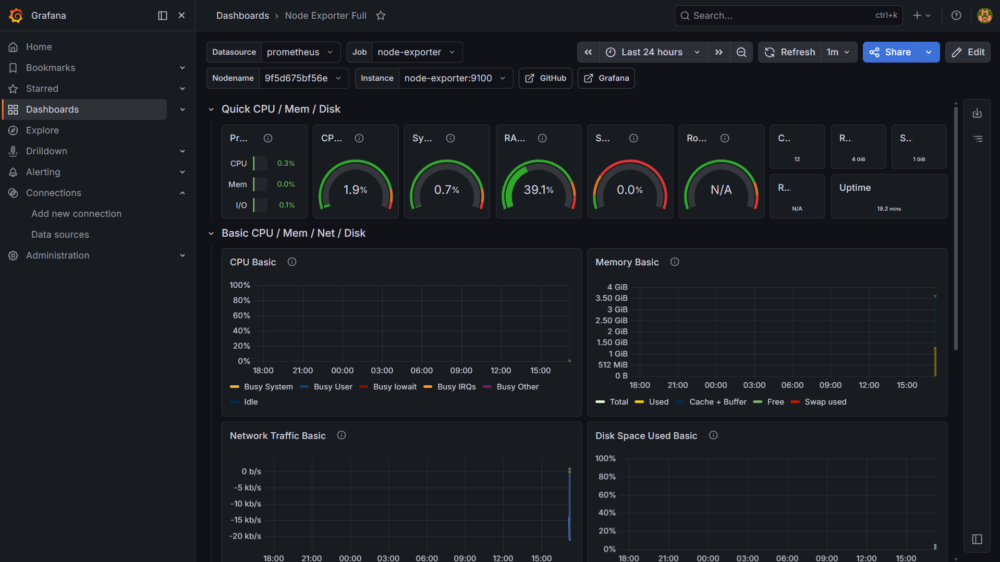
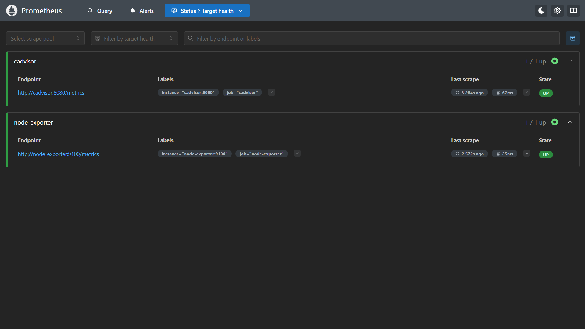

# NodePulse

Infrastructure Monitoring & Observability Platform

NodePulse is a lightweight local infrastructure monitoring platform built using Docker, Prometheus, Grafana, Loki, Promtail, Node Exporter, and cAdvisor.

It provides real-time monitoring for:

- System metrics
- Container metrics
- Infrastructure health
- Centralized logging
- Observability dashboards

The project simulates a real-world DevOps monitoring stack used in modern backend and cloud infrastructure environments.

---

# Features

## Infrastructure Monitoring
- CPU usage monitoring
- Memory usage monitoring
- Disk usage monitoring
- Network monitoring
- Host system metrics

## Container Monitoring
- Running containers monitoring
- Container CPU usage
- Container memory usage
- Container resource tracking

## Logging System
- Centralized log aggregation
- Live log streaming
- System log collection
- Log visualization in Grafana

## Visualization
- Real-time Grafana dashboards
- Infrastructure overview
- Monitoring panels
- Metrics visualization

---

# Tech Stack

| Area | Tool |
|------|------|
| Containerization | Docker |
| Metrics Collection | Prometheus |
| Visualization | Grafana |
| Log Aggregation | Loki |
| Log Collection | Promtail |
| System Metrics | Node Exporter |
| Container Metrics | cAdvisor |

---

# Architecture

```text
                 +-------------------+
                 |   Node Exporter   |
                 +-------------------+
                           |
                           v
                    +-------------+
                    | Prometheus  |
                    +-------------+
                           |
                           v
                    +-------------+
                    |  Grafana    |
                    +-------------+

                 +-------------------+
                 |     cAdvisor      |
                 +-------------------+
                           |
                           v
                    +-------------+
                    | Prometheus  |
                    +-------------+

                 +-------------------+
                 |    System Logs    |
                 +-------------------+
                           |
                           v
                    +-------------+
                    |  Promtail   |
                    +-------------+
                           |
                           v
                    +-------------+
                    |    Loki     |
                    +-------------+
                           |
                           v
                    +-------------+
                    |   Grafana   |
                    +-------------+
```

---

# Project Structure

```text
nodepulse/
├── docker-compose.yml
├── README.md
├── .gitignore
├── prometheus/
│   └── prometheus.yml
├── loki/
│   └── config.yml
├── promtail/
│   └── config.yml
└── screenshots/
```

---

# Services

| Service | Port |
|----------|------|
| Grafana | 3000 |
| Prometheus | 9090 |
| Loki | 3100 |
| cAdvisor | 8080 |
| Node Exporter | 9100 |

---

# Screenshots

## Grafana Dashboard



---

## Prometheus Targets



---

# Getting Started

## Clone Repository

```bash
git clone git@github.com:Naitikkhaniya/nodepulse.git
cd nodepulse
```

---

# Start Services

```bash
docker compose up -d
```

---

# Verify Running Containers

```bash
docker ps
```

---

# Access Dashboards

## Grafana

http://localhost:3000

Default credentials:

```text
Username: admin
Password: admin
```

---

## Prometheus

http://localhost:9090

---

## Loki

http://localhost:3100

---

## cAdvisor

http://localhost:8080

---

# Grafana Setup

## Add Prometheus Datasource

URL:

```text
http://prometheus:9090
```

---

## Add Loki Datasource

URL:

```text
http://loki:3100
```

---

# Dashboard Used

Grafana Dashboard ID:

```text
1860
```

Node Exporter Full Dashboard

---

# Skills Learned

## DevOps Skills
- Infrastructure monitoring
- Observability
- Log aggregation
- Metrics collection
- Docker orchestration
- System monitoring

## Linux Skills
- Linux containers
- Networking
- System processes
- Service monitoring
- Infrastructure debugging

## Monitoring Concepts
- Metrics vs Logs
- Time-series monitoring
- Exporters
- Scraping
- Centralized logging

---

# Real-World Use Cases

NodePulse simulates real infrastructure monitoring systems used in:

- Cloud platforms
- Backend infrastructure
- DevOps environments
- SRE teams
- Containerized applications

Similar enterprise tools include:

- Datadog
- New Relic
- Grafana Cloud

---

# Future Improvements

- Alertmanager integration
- Email/Slack alerts
- Persistent Docker volumes
- Kubernetes monitoring
- OpenTelemetry integration
- Distributed tracing

---

# Author

Naitik Khaniya

GitHub:
https://github.com/Naitikkhaniya
